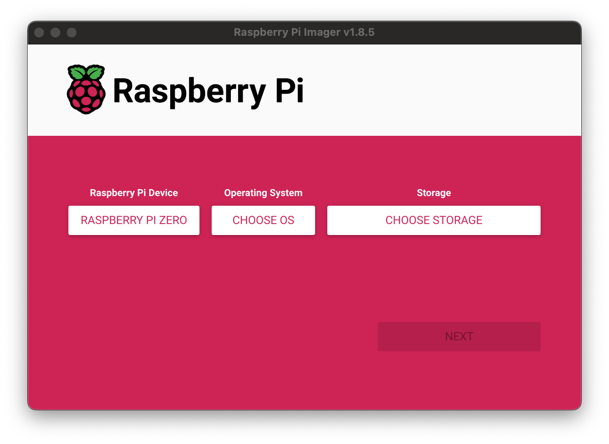

# 🔧 Embedded System - Raspberry Pi Zero W Integration

IoT-enabled embedded system component for real-time hardware control and sensor monitoring using Raspberry Pi Zero W.

## 🚀 Features

- **GPIO Control**: Direct hardware interfacing
- **HTTP Communication**: REST API integration
- **Real-time Processing**: Low-latency sensor data handling
- **WiFi Connectivity**: Wireless communication support
- **Lightweight Design**: Optimized for Raspberry Pi Zero W

## 📋 Hardware Requirements

- **Raspberry Pi Zero W** (with WiFi/Bluetooth)
- **MicroSD Card** (16GB+ recommended)
- **Power Supply** (5V micro-USB)
- **GPIO Sensors/Actuators** (project-specific)

## ⚡ Quick Setup Guide

### 1. Prepare Raspberry Pi OS

#### Download Raspberry Pi Imager
Visit: https://www.raspberrypi.com/software/

#### OS Installation Steps
1. **Select Device**: Raspberry Pi Zero W
2. **Choose OS**: Raspberry Pi OS Lite (32-bit)
3. **Select Storage**: Your microSD card
4. **Configure WiFi**: Enable SSH and set WiFi credentials



### 2. Initial System Setup

#### SSH Connection
```bash
# Connect via SSH (ensure both devices are on same network)
ssh <username>@<raspberry_pi_ip_address>
```

#### Create Project Directory
```bash
mkdir cranecorp
cd cranecorp
```

### 3. Install Dependencies

#### HTTP Library
```bash
# Download cpp-httplib for HTTP communication
wget https://raw.githubusercontent.com/yhirose/cpp-httplib/master/httplib.h
```

#### GPIO Library
```bash
# Install and configure pigpio for GPIO control
sudo apt update
sudo apt install pigpio pigpio-tools
sudo systemctl start pigpiod
sudo systemctl enable pigpiod
```

### 4. Deploy Application Code

#### Download Source Code
```bash
# Method 1: Direct download
wget https://raw.githubusercontent.com/ayan-furkan/CRANECORP/main/EMBEDDED/cranecorp.cpp

# Method 2: Clone repository
git clone https://github.com/ayan-furkan/CRANECORP.git
cp CRANECORP/EMBEDDED/cranecorp.cpp .
```

#### Compile Application
```bash
# Compile with necessary libraries
g++ -o cranecorp cranecorp.cpp -lpigpio -pthread

# Alternative: Use Makefile
make
```

#### Run Application
```bash
# Run with sudo for GPIO access
sudo ./cranecorp
```

## 🏗️ Project Structure

```
EMBEDDED/
├── cranecorp.cpp      # Main application source
├── Makefile          # Build configuration
├── README.md         # This documentation
└── images/
    └── rasp_imager.png
```

## 🛠️ Development

### Build System
The project includes a Makefile for easy compilation:
```bash
make clean    # Clean build artifacts
make build    # Compile application
make run      # Build and run
```

### GPIO Configuration
- Configure pin mappings in `cranecorp.cpp`
- Ensure proper pin voltage levels (3.3V logic)
- Implement safety checks for hardware protection

### Network Configuration
- Set server endpoints in source code
- Configure WiFi credentials during OS setup
- Ensure firewall allows required ports

## 🔧 Troubleshooting

### Common Issues

**Compilation Errors:**
```bash
# Install build essentials
sudo apt install build-essential

# Update package lists
sudo apt update && sudo apt upgrade
```

**GPIO Permission Errors:**
```bash
# Always run with sudo for GPIO access
sudo ./cranecorp

# Or add user to gpio group
sudo usermod -a -G gpio $USER
```

**Network Connectivity:**
```bash
# Test internet connection
ping google.com

# Check WiFi status
iwconfig
```

### Performance Optimization
- Use lightweight communication protocols
- Implement efficient sensor polling
- Optimize GPIO operations for real-time performance

## 📡 Integration

### API Communication
The embedded system communicates with the backend server via HTTP requests:
- Sensor data transmission
- Command reception
- Status reporting

### Mobile App Integration
Real-time data flows from embedded system → backend → mobile app for:
- Live monitoring
- Remote control
- Alert notifications

## 📚 Additional Resources

- [Raspberry Pi Documentation](https://www.raspberrypi.org/documentation/)
- [pigpio Library Guide](http://abyz.me.uk/rpi/pigpio/)
- [Main Project Documentation](../README.md)