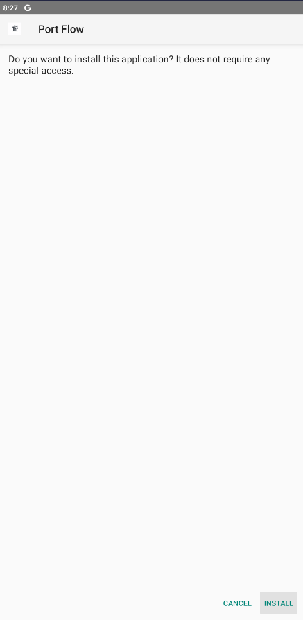
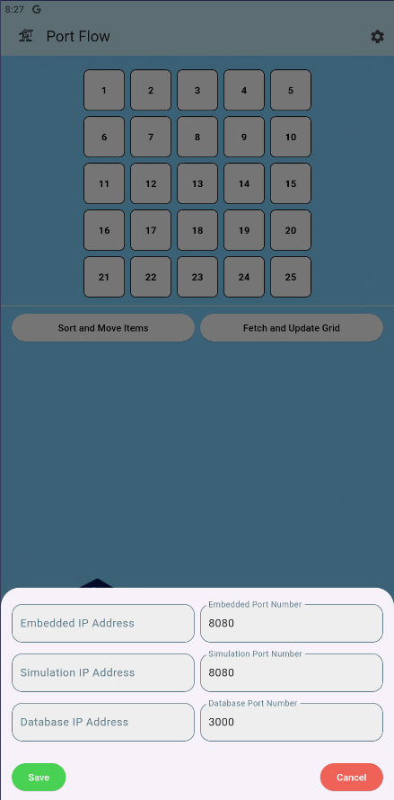

# 📱 Mobile Application - PortFlow

Cross-platform mobile application built with Flutter for comprehensive port management and real-time monitoring.

## 🚀 Features

- **Real-time Monitoring**: Live equipment status updates
- **Cross-platform**: iOS and Android support
- **Intuitive UI**: User-friendly interface design
- **Remote Control**: Equipment management capabilities
- **Network Configuration**: Customizable server connections

## 📋 Prerequisites

- Flutter SDK (3.0 or higher)
- Dart SDK
- Android Studio / VS Code
- iOS development tools (for iOS builds)

## ⚡ Quick Start

### Option 1: Install Pre-built APK (Android Only)

1. **Download the APK**
   ```bash
   # Download directly to your Android device
   https://github.com/ayan-furkan/CRANECORP/raw/main/MOBILE/portflow.apk
   ```

2. **Install the Application**
   - Enable "Install from Unknown Sources" in Android settings
   - Open the downloaded APK file
   - Follow installation prompts

   

3. **Configure Network Settings**
   - Open the PortFlow application
   - Navigate to Settings
   - Enter your server IP addresses

   

### Option 2: Build from Source

#### 1. Install Flutter SDK

**For Linux/macOS:**
```bash
# Download Flutter SDK
curl -O https://storage.googleapis.com/flutter_infra_release/releases/stable/linux/flutter_linux_3.16.0-stable.tar.xz

# Extract
cd ~/Downloads
tar xf flutter_linux_*.tar.xz

# Add to PATH
echo 'export PATH="$PATH:$HOME/Downloads/flutter/bin"' >> ~/.bashrc
source ~/.bashrc
```

**For other platforms:** Visit [Flutter Installation Guide](https://docs.flutter.dev/get-started/install)

#### 2. Verify Installation
```bash
flutter doctor
```

#### 3. Setup Project
```bash
# Navigate to project directory
cd MOBILE/crane_corp

# Install dependencies
flutter pub get

# Run the application
flutter run
```

## 🏗️ Project Structure

```
MOBILE/
├── portflow.apk           # Pre-built Android APK
├── crane_corp/            # Flutter project source
│   ├── lib/
│   │   └── main.dart      # Main application entry
│   ├── assets/            # Images and resources
│   ├── android/           # Android configuration
│   ├── ios/               # iOS configuration
│   └── pubspec.yaml       # Dependencies
└── images/                # Documentation images
```

## 🛠️ Development

### Running in Development Mode
```bash
# Debug mode (hot reload enabled)
flutter run

# Release mode
flutter run --release

# Specific device
flutter run -d <device_id>
```

### Building for Production
```bash
# Android APK
flutter build apk --release

# iOS (requires macOS)
flutter build ios --release

# Web
flutter build web
```

## 📱 App Configuration

### Network Settings
- Configure server endpoints in the app settings
- Ensure your device is on the same network as the backend server
- Default server runs on port 3000

### Permissions Required
- Internet access
- Network state access
- Storage permissions (for data caching)

## 🔧 Troubleshooting

### Common Issues
- **Flutter not found**: Ensure Flutter is added to your PATH
- **Device not detected**: Enable USB debugging on Android
- **Build failures**: Run `flutter clean` and `flutter pub get`

### Dependencies Issues
```bash
# Clear cache and reinstall
flutter clean
flutter pub cache repair
flutter pub get
```

## 📚 Additional Resources

- [Flutter Documentation](https://docs.flutter.dev/)
- [Dart Language Guide](https://dart.dev/guides)
- [Main Project Documentation](../README.md)
